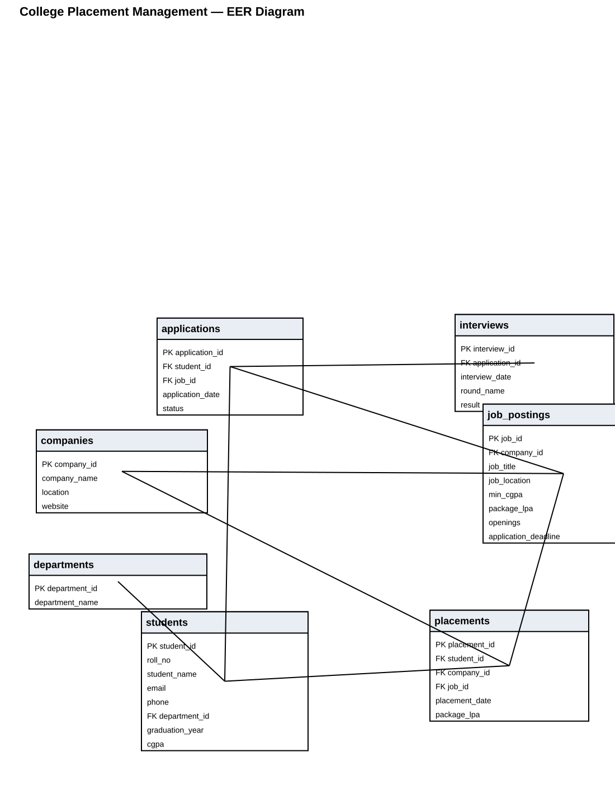

# College Placement Management System

A MySQL database project for managing students, companies, job postings, applications, interviews and placement records.

## Main Tables
- Departments
- Students
- Companies
- Job Postings
- Applications
- Interviews
- Placements

## SQL Topics
JOIN, subqueries, GROUP BY, HAVING, CTE, CASE, aggregate functions and window functions.

## EER Diagram

The original MySQL Workbench model is also included in `docs/EER_Diagram.mwb` for opening/editing in MySQL Workbench.

## Run
Open MySQL Workbench, run `database/schema.sql`, then `database/sample_data.sql` and `database/reports.sql`.
